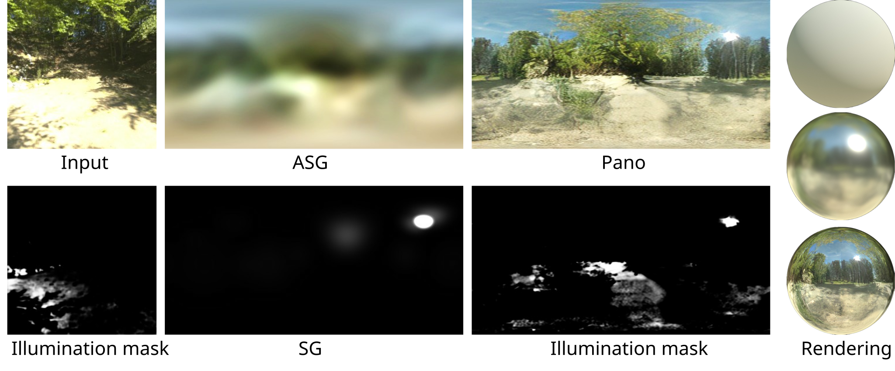

# IllumiDiff: ~~Indoor~~ Illumination Estimation from a Single Image with Diffusion Model (TVCG 2025)

[Shiyuan Shen<sup>†</sup>](https://nauyihsnehs.github.io/), [Zhongyun Bao<sup>†</sup>](https://www.researchgate.net/profile/Zhongyun-Bao), [Wenju Xu](https://xuwenju123.github.io/), [Chunxia Xiao](https://graphvision.whu.edu.cn/)

**[📘Paper](https://ieeexplore.ieee.org/document/10945728)** · **[📃PDF](https://graphvision.whu.edu.cn/paper/2025/ShenShiYuan_TVCG_2025.pdf)** · **[🏠HomePage](https://nauyihsnehs.github.io/papars/illumidiff)** · **[🤗Demo](https://huggingface.co/spaces/shenshiyuan/IllumiDiff)**

<p>
  
</p>

###

The current version builds on LDM.

Unlike the original paper, we retrain the models at all stages using 3,229 (training set) HDR panoramas without separating indoor and outdoor scenes.

The ControlNet implementation is available in the [v-controlnet](https://github.com/nauyihsnehs/IllumiDiff/tree/v-controlnet) branch.

## Structure

```text
IllumiDiff/
├── ckpts/                      # downloaded checkpoints for inference
├── lighting_est/               # Stage 1 and Stage 3 models, datasets, and training
├── pano_ldm/                   # Stage 2 latent diffusion implementation
├── datasets/                   # preprocessing, fitting, splitting, and inpainting tools
├── utils.py                    # image, logging, runtime, and panorama utilities
├── inference.py                # full pipeline, ldr pers to hdr pano
└── inference_single.py         # parameterized SG + ASG lighting
```

## Environment

```bash
conda create -n illumidiff python=3.11
conda activate illumidiff
pip install torch==2.7.1 torchvision==0.22.1 --index-url https://download.pytorch.org/whl/cu118
pip install -r requirements.txt
```

## Checkpoints

Download the checkpoints from
[☁️OneDrive](https://1drv.ms/f/s!AteITnyFLzOYj6x_vV0lu5uhoTVjJQ?e=YJViCX)
or
[🤗Buckets](https://huggingface.co/buckets/shenshiyuan/illumidiff-ckpts)
and place them in `./ckpts/`:

```text
id_net-step020k.ckpt
sg_net-step080k.ckpt
asg_net-step100k.ckpt
hdr_net-step038k.ckpt
ldm-step015k.ckpt
```

## Inference

Full `lighting estimation` + `panorama generation` + `inverse tonemapping` inference:

```bash
python inference.py --input-path <path> --output-path <path>
```

Linear SG + ASG output:

```bash
python inference_single.py --input-path <path> --output-path <path>
```

## Quantitative Comparison

| Metric     |                          IllumiDiff |              DiffusionLight |                  LuxDiT |
|:-----------|------------------------------------:|----------------------------:|------------------------:|
| Base moel  |                                 LDM |                        SDXL |                CogVideo |
| Parameters |                          ~ **0.7**B |                      ~ 3.5B |                    ~ 5B |
| SI-RMSE    | **0.103** \| **0.185** \| **0.206** |     0.123 \| 0.216 \| 0.239 | 0.114 \| 0.211 \| 0.231 |
| PSNR       | **17.43** \| **13.99** \| **12.62** |     15.54 \| 12.84 \| 11.72 | 16.70 \| 12.95 \| 12.02 |
| RGB ang.   |    **3.37** \| **4.30** \| **5.27** |        3.98 \| 4.84 \| 5.78 |    3.96 \| 4.78 \| 5.75 |   
| FID        |    114.67 \| **29.09** \| **44.60** | **22.57** \| 34.78 \| 87.23 | 94.69 \| 32.52 \| 81.21 |              

## Dataset

Start with a folder of HDR panoramas:

```bash
# Original HDR panoramas -> paired rotated pano/perspective HDR and LDR data
python datasets/build_dataset.py --input-dir <hdr-folder> --dataset-root <dataset_root>

# Fit parameterized lighting GT
python datasets/sg_fitting.py --dataset-root <dataset_root>
python datasets/asg_fitting.py --dataset-root <dataset_root>

# Preview a split before moving complete modality groups.
python datasets/split_testset.py --dataset-root <dataset_root>
```

## Training

All networks are trained separately.

For id_net, sg_net, asg_net or hdr_net:

```bash
python -m lighting_est.train --config lighting_est/configs/<network>.toml
```

For LDM:

```bash
python -m pano_ldm.train_vae_1ch --config pano_ldm/configs/train_vae.toml
python -m pano_ldm.train --config pano_ldm/configs/train.toml --init-ckpt <init-path>
```

## Acknowledgements

This project builds on ideas and components from [LDM](https://github.com/CompVis/latent-diffusion)) and [Skylibs](https://github.com/soravux/skylibs).

## Citation

```bibtex
@article{shen2025illumidiff,
    title = {IllumiDiff: Indoor Illumination Estimation from a Single Image with Diffusion Model},
    author = {Shen, Shiyuan and Bao, Zhongyun and Xu, Wenju and Xiao, Chunxia},
    journal = {IEEE transactions on visualization and computer graphics},
    year = {2025},
    publisher = {IEEE}
}
```

## Contact

For questions, please contact:
[syshen@whu.edu.cn](mailto:syshen@whu.edu.cn)

[](https://visitor-badge.laobi.icu/)
